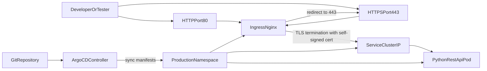

# System Architecture

## Flow

1. User traffic reaches ingress.
2. Port 80 is redirected to HTTPS 443.
3. Ingress terminates TLS with the Kubernetes TLS secret.
4. Traffic is routed to `cibus-api` service and then to API pods.
5. ArgoCD watches Git and continuously reconciles manifests into `production`.
